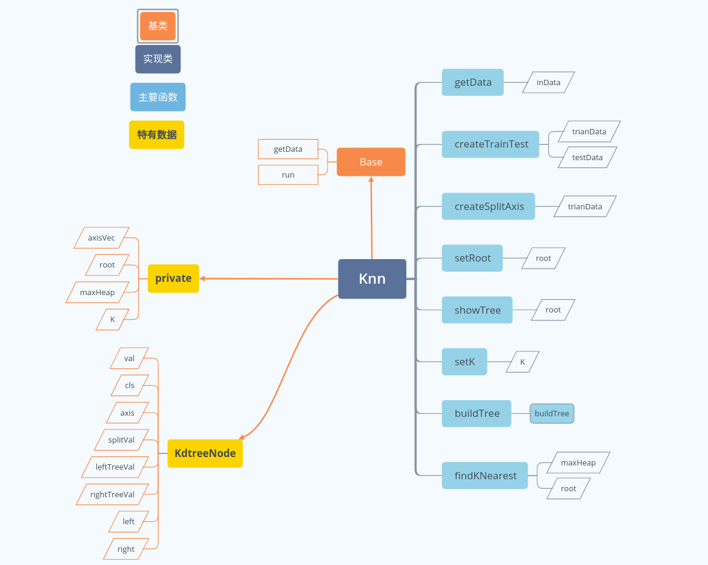
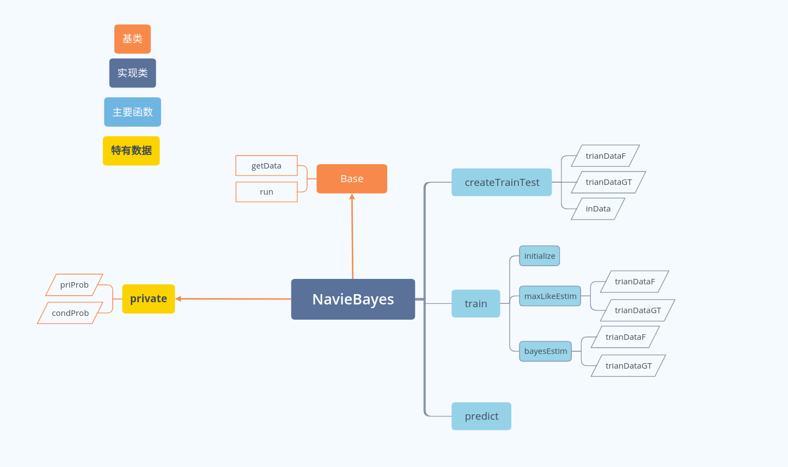
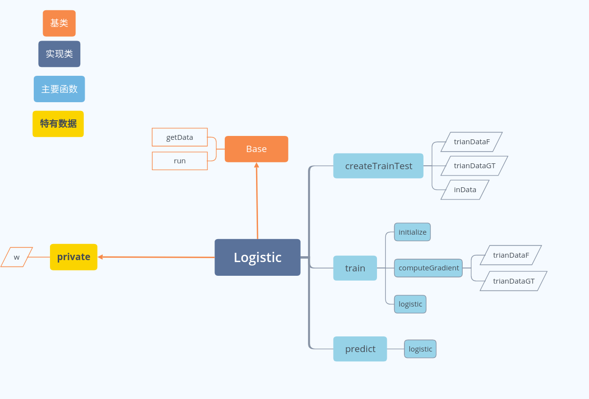
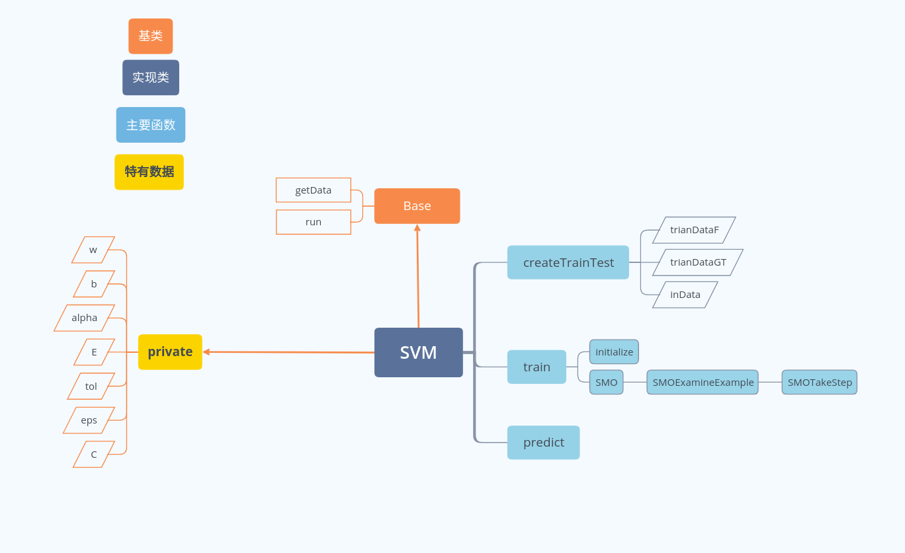

# statistical-learning
用c++实现《统计学习方法》中的算法，主要是为了练习c++编程，以及机器学习的知识。

要用哪个模型，需要在main.cpp中包含相应的头文件，然后将

```c++ 
Base* obj = new Knn();
```

new后面的模型名称换为相应的类名即可。

具体的配置可以先看每个类run的实现，以后会更改，让他们变得更容易使用。

# 代码结构图

## 感知机


## k近邻




##  朴素贝叶斯




##  决策树


## 逻辑回归



##支持向量机

